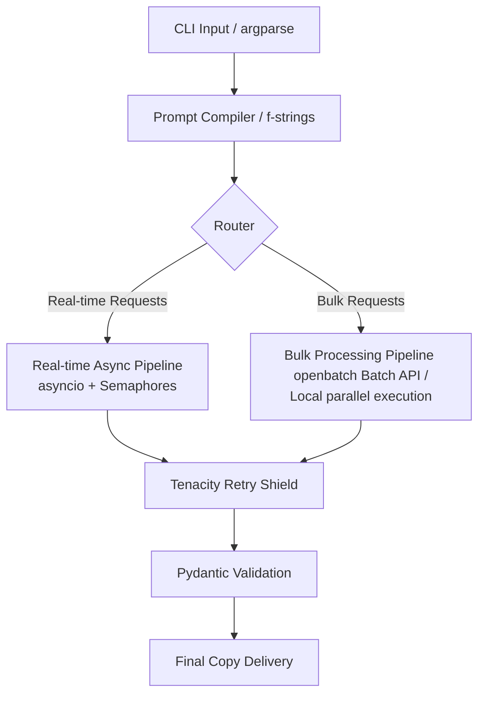

# Automated Copywriting & Tone Transformer

An enterprise-grade, concurrent content generation engine designed to transform raw product features and facts into high-converting, platform-specific marketing copy using advanced LLMs (Groq, Gemini, and OpenAI).

This project compiles dynamic prompt templates while strictly enforcing length limitations, target tones, and safety guidelines across social platforms, featuring dual-execution pipelines and built-in API rate-limit resilience.

---

## Key Features

- **Multi-Provider Support**: Pluggable support for Groq (Llama 3.3), Google Gemini API, and native OpenAI client configurations.
- **Strict Pydantic Schema Validation**: Enforces structured JSON output format (`headline`, `body`, `call_to_action`, `hashtags`) via Pydantic model validation.
- **Dynamic Platform Constraints**: Adjusts copywriting styles and hard character constraints programmatically per target platform:
  - **Twitter/X**: Max 280 characters, punchy hooks.
  - **Instagram**: Max 2200 characters, emoji-rich, focus on hashtags.
  - **LinkedIn**: Max 3000 characters, professional, value-driven.
  - **Email**: Max 10000 characters, structured email templates.
- **Dual-Execution Pipelines**:
  - **Real-time Async Pipeline**: Executes parallel API calls concurrently using `asyncio.gather` for real-time applications.
  - **Bulk Pipeline**: Parses input files, prepares standard batch payloads using `openbatch` `.jsonl` collectors, and processes them concurrently or submits to the OpenAI Batch API.
- **Rate-Limit & Quota Resilience**: Includes an `asyncio.Semaphore` concurrency cap (limited to 10 connections) and a `tenacity` retry shield with randomized exponential backoff to handle API `429` (too many requests) errors.
- **Custom Argument Parsing**: Configured CLI using `argparse` with `prefix_chars="-+"` to handle custom action flags (e.g., `+a platform`).

---

## Technical Architecture Flow



---

## File Structure

```text
├── models.py         # Pydantic structured output models
├── templates.py      # Master copywriting prompt compiler
├── pipelines.py      # Dual real-time & bulk execution controllers
├── run.py            # Main CLI entry point and argument router
├── requirements.txt  # Project dependency libraries
├── input_products.csv# Example input CSV for bulk runs
└── .env              # Local environment configuration keys (git-ignored)
```

---

## Installation & Setup

1. **Clone the Repository**:
   ```bash
   git clone https://github.com/your-username/copywriting-transformer.git
   cd copywriting-transformer
   ```

2. **Create a Virtual Environment**:
   ```bash
   python -m venv venv
   # On Windows:
   .\venv\Scripts\activate
   # On macOS/Linux:
   source venv/bin/activate
   ```

3. **Install Dependencies**:
   ```bash
   pip install -r requirements.txt
   ```

4. **Configure Environment Variables**:
   Create a `.env` file in the root of the project and add your API keys:
   ```env
   GROQ_API_KEY=your_groq_api_key
   GEMINI_API_KEY=your_gemini_api_key
   OPENAI_API_KEY=your_openai_api_key
   ```
   *Note: The script prioritizes keys in the order: Groq -> Gemini -> OpenAI. If no keys are set, it runs in **Mock Mode** for safe testing.*

---

## How to Run

### 1. Real-time Async Mode
Generate copywriting for a single product across multiple platforms in parallel:
```bash
python run.py --product "Smart Desk Lamp" --description "Adjusts brightness based on time of day, reduces eye strain, and features a wireless charger." --tone "witty" +a linkedin +a twitter
```

### 2. Bulk CSV Mode
Process multiple products at once from a CSV file (e.g., `input_products.csv`):
```bash
python run.py --csv input_products.csv
```
This prepares a standard batch file using `openbatch` (`copy_bulk_batch_requests.jsonl`) and executes all requests concurrently, saving results to `copy_bulk_results.json`.
